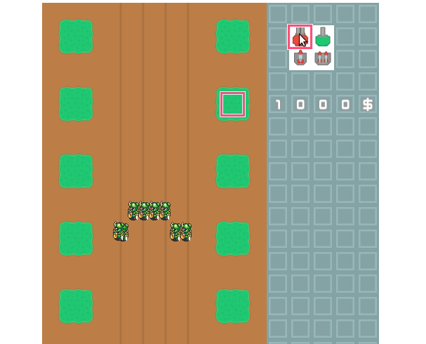

# Phaser3 Tower Defense

Tower Defense prototype written in Phaser3 with Typescript, using MatterJS as a physics system for bullet/enemy behavior.
Enemies approach from the top, guns can be placed on designated positions and attack the enemies.

# Run

`npm install && npm run dev`

# Demo

